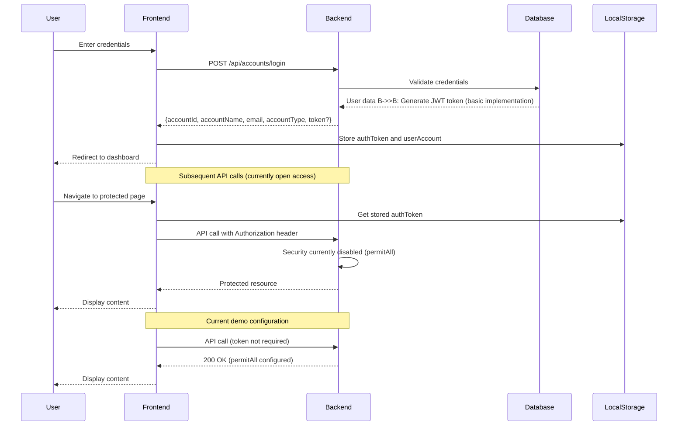

# Flight Management System - Integration Documentation

## Table of Contents
1. [System Overview](#system-overview)
2. [API Integration Mapping](#api-integration-mapping)
3. [Authentication Flow](#authentication-flow)
4. [Data Flow Diagrams](#data-flow-diagrams)
5. [Frontend-Backend Interface](#frontend-backend-interface)
6. [Deployment Architecture](#deployment-architecture)
7. [Development Setup](#development-setup)
8. [Testing Integration](#testing-integration)
9. [Troubleshooting](#troubleshooting)

## System Overview

The Flight Management System consists of two main components:

### Backend (Spring Boot)
- **Technology**: Java 17, Spring Boot 3.x, MySQL 8.0
- **Port**: 8080
- **Base URL**: `http://localhost:8080/api`
- **Architecture**: RESTful API with layered architecture
- **Security**: Currently in demo mode with permitAll configuration

### Frontend (React)
- **Technology**: React 18, TypeScript, Vite
- **Port**: 3000
- **Base URL**: `http://localhost:3000`
- **Architecture**: Single Page Application (SPA)
- **Communication**: HTTP REST API calls via Axios

### System Architecture Diagram
```
┌─────────────────┐    HTTP/REST API    ┌─────────────────┐
│                 │ ◄─────────────────► │                 │
│   React Frontend│                     │  Spring Boot    │
│   (Port 3000)   │                     │  Backend        │
│                 │                     │  (Port 8080)    │
└─────────────────┘                     └─────────────────┘
         │                                        │
         │                                        │
         ▼                                        ▼
┌─────────────────┐                     ┌─────────────────┐
│   Browser       │                     │   MySQL         │
│   Local Storage │                     │   Database      │
│   (authToken)   │                     │   (Port 3306)   │
└─────────────────┘                     └─────────────────┘
```

## API Integration Mapping

### Frontend Service Layer → Backend Controllers

#### Authentication & User Management
```typescript
// Frontend: accountService.ts
class AccountService {
  async login(credentials: LoginRequest): Promise<LoginResponseDto>
  async register(userData: RegisterRequest): Promise<void>
  // Note: logout is handled client-side only
  // Note: profile management endpoints may not be implemented
}

// Maps to Backend: AccountController.java
@RestController
@RequestMapping("/api/accounts")
public class AccountController {
  @PostMapping("/login")           // ← accountService.login()
  @PostMapping("/register")        // ← accountService.register()
  // Note: All endpoints currently permit all access (demo mode)
}
```

### Account Type Mapping
The system uses consistent account type mapping across frontend and backend:
- `accountType: 1` = Customer (access to booking and personal ticket management)
- `accountType: 2` = Employee (access to admin panels and management functions)

### Employee Types (for accountType = 2)
1. **Flight Schedule Reception** (tiep nhan lich bay) - Manage flight schedules
2. **Ticket Sales/Booking** (ban/dat ve) - Handle reservations and sales  
3. **Customer Service** (cskh) - Support and chat
4. **Accounting** (ke toan) - Financial operations
5. **System Administrator** (sa) - Full system access

#### Flight Operations
```typescript
// Frontend: flightService.ts
class FlightService {
  async searchFlights(criteria: SearchCriteria): Promise<Flight[]>
  async getFlightById(id: number): Promise<Flight>
  async getFlightsByRoute(departureAirportId: number, arrivalAirportId: number): Promise<Flight[]>
  async getAllFlights(): Promise<Flight[]>
  async createFlight(data: CreateFlightRequest): Promise<Flight>  // Admin only
  async updateFlight(id: number, data: UpdateFlightRequest): Promise<Flight>  // Admin only
  async deleteFlight(id: number): Promise<void>  // Admin only
}

// Maps to Backend: FlightController.java
@RestController
@RequestMapping("/api/flights")
public class FlightController {
  @PostMapping("/search")          // ← flightService.searchFlights() (POST with body)
  @GetMapping("/{id}")             // ← flightService.getFlightById()
  @GetMapping("/route")            // ← flightService.getFlightsByRoute() (with query params)
  @GetMapping                      // ← flightService.getAllFlights()
  @PostMapping                     // ← flightService.createFlight()
  @PutMapping("/{id}")             // ← flightService.updateFlight()
  @DeleteMapping("/{id}")          // ← flightService.deleteFlight()
  @GetMapping("/code/{code}")      // ← flightService.getFlightByCode()
  @GetMapping("/date-range")       // ← flightService.getFlightsByDateRange()
}
```

#### Ticket Booking & Management
```typescript
// Frontend: ticketService.ts
class TicketService {
  async bookTickets(booking: BookingRequest): Promise<Ticket[]>
  async getTicketById(id: number): Promise<Ticket>
  async getTicketsByCustomer(customerId: number): Promise<Ticket[]>
  async cancelTicket(id: number): Promise<void>
  async getAvailableSeats(flightId: number, classId: number): Promise<string[]>
  async getAllTickets(): Promise<Ticket[]>  // Admin only
  async updateTicket(id: number, data: UpdateTicketRequest): Promise<Ticket>  // Admin only
}

// Maps to Backend: TicketController.java
@RestController
@RequestMapping("/api/tickets")
public class TicketController {
  @PostMapping("/book")            // ← ticketService.bookTickets()
  @GetMapping("/{id}")             // ← ticketService.getTicketById()
  @GetMapping("/customer/{id}")    // ← ticketService.getTicketsByCustomer()
  @DeleteMapping("/{id}")          // ← ticketService.cancelTicket()
  @GetMapping("/seats/available")  // ← ticketService.getAvailableSeats()
  @GetMapping                      // ← ticketService.getAllTickets()
  @PutMapping("/{id}")             // ← ticketService.updateTicket()
}
```

#### Administrative Operations
```typescript
// Frontend: Admin Components → Multiple Services
AdminPanel.tsx → {
  airportService.getAllAirports()          // → AirportController.getAllAirports()
  employeeService.getAllEmployees()        // → EmployeeController.getAllEmployees()
  customerService.getAllCustomers()        // → CustomerController.getAllCustomers()
  parameterService.getAllParameters()      // → ParameterController.getAllParameters()
}

AirportManagement.tsx → {
  airportService.createAirport()           // → AirportController.createAirport()
  airportService.updateAirport()           // → AirportController.updateAirport()
  airportService.deleteAirport()           // → AirportController.deleteAirport()
}

FlightManagement.tsx → {
  flightService.createFlight()             // → FlightController.createFlight()
  flightService.updateFlight()             // → FlightController.updateFlight()
  flightService.deleteFlight()             // → FlightController.deleteFlight()
  planeService.getAllPlanes()              // → PlaneController.getAllPlanes()
}
```

## Authentication Flow

### Complete Authentication Sequence



### Frontend Authentication Implementation

#### JWT Token Management
```typescript
// Frontend: api.ts - Request Interceptor
apiClient.interceptors.request.use((config) => {
  const token = localStorage.getItem('authToken');
  if (token) {
    config.headers.Authorization = `Bearer ${token}`;
  }
  return config;
});

// Response Interceptor for 401 handling
apiClient.interceptors.response.use(
  (response) => response.data,
  (error) => {
    if (error.response?.status === 401) {
      localStorage.removeItem('authToken');
      localStorage.removeItem('userAccount');
      window.location.href = '/login';
    }
    throw error;
  }
);
```

#### Backend JWT Validation
```java
// Backend: JWT validation is currently disabled for demo purposes
// The SecurityConfig.java is configured with permitAll() for all endpoints
// Future JWT implementation would look like this:

@Component
public class JwtAuthenticationFilter extends OncePerRequestFilter {
    
    @Override
    protected void doFilterInternal(HttpServletRequest request, 
                                  HttpServletResponse response, 
                                  FilterChain filterChain) {
        // JWT validation logic would be implemented here
        // Currently bypassed due to permitAll() configuration
        
        String token = extractTokenFromRequest(request);
        
        if (token != null && jwtUtil.validateToken(token)) {
            String username = jwtUtil.getUsernameFromToken(token);
            UserDetails userDetails = userDetailsService.loadUserByUsername(username);
            
            UsernamePasswordAuthenticationToken authentication = 
                new UsernamePasswordAuthenticationToken(userDetails, null, userDetails.getAuthorities());
            SecurityContextHolder.getContext().setAuthentication(authentication);
        }
        
        filterChain.doFilter(request, response);
    }
}

// Note: This filter is not currently active due to demo configuration
```

### Role-Based Access Control Integration

#### Frontend Role Checking
```typescript
// Frontend: useAuth.tsx - Actual Implementation
interface AuthContextType {
  user: Account | null;
  login: (email: string, password: string) => Promise<void>;
  register: (registerRequest: RegisterRequest) => Promise<void>;
  logout: () => void;
  loading: boolean;
}

// Authentication Provider Implementation
export const AuthProvider: React.FC<AuthProviderProps> = ({ children }) => {
  const [user, setUser] = useState<Account | null>(null);
  const [loading, setLoading] = useState(true);

  const login = async (email: string, password: string) => {
    const response = await accountService.login({ email, password });
    
    const userAccount: Account = {
      accountId: response.accountId,
      accountName: response.accountName,
      email: response.email,
      accountType: response.accountType
    };
    
    setUser(userAccount);
    if (response.token) {
      localStorage.setItem('authToken', response.token);
    }
    localStorage.setItem('userAccount', JSON.stringify(userAccount));
  };

  const logout = () => {
    localStorage.removeItem('userAccount');
    localStorage.removeItem('authToken');
    setUser(null);
  };
};

// Role checking based on accountType (1 = admin, 2 = customer)
export const usePermissions = () => {
  const { user } = useAuth();
  
  return {
    canViewAdmin: user?.accountType === 1,
    canManageFlights: user?.accountType === 1,
    canBookTickets: user?.accountType === 2,
    canViewReports: user?.accountType === 1
  };
};
```

#### Backend Security Configuration
```java
// Backend: SecurityConfig.java - Current Demo Configuration
@EnableWebSecurity
public class SecurityConfig {
    
    @Bean
    public CorsConfigurationSource corsConfigurationSource() {
        CorsConfiguration configuration = new CorsConfiguration();
        configuration.setAllowedOrigins(Arrays.asList(
            "http://localhost:3000", 
            "http://localhost:5173", 
            "http://localhost:4173"
        ));
        configuration.setAllowedMethods(Arrays.asList("GET", "POST", "PUT", "DELETE", "OPTIONS"));
        configuration.setAllowedHeaders(Arrays.asList("Content-Type", "Authorization", "X-Requested-With"));
        configuration.setAllowCredentials(false);
        configuration.setMaxAge(3600L);
        
        UrlBasedCorsConfigurationSource source = new UrlBasedCorsConfigurationSource();
        source.registerCorsConfiguration("/**", configuration);
        return source;
    }
    
    @Bean
    public SecurityFilterChain filterChain(HttpSecurity http) throws Exception {
        http.csrf(csrf -> csrf.disable())
            .cors(cors -> cors.configurationSource(corsConfigurationSource()))
            .sessionManagement(session -> session.sessionCreationPolicy(SessionCreationPolicy.STATELESS))
            .authorizeHttpRequests(auth -> auth
                .requestMatchers("/api/accounts/login", "/api/accounts/register").permitAll()
                .requestMatchers("/api/flights/**", "/api/airports/**", "/api/ticket-classes/**").permitAll()
                .requestMatchers("/api/planes/**", "/api/passengers/**", "/api/tickets/**").permitAll()
                .requestMatchers("/api/chatboxes/**", "/api/messages/**").permitAll()
                .requestMatchers("/api/customers/**", "/api/employees/**").permitAll()
                .requestMatchers("/api/flight-details/**", "/api/flight-ticket-classes/**").permitAll()
                .requestMatchers("/actuator/health").permitAll()
                .requestMatchers("/api/parameters/**").permitAll()
                .anyRequest().permitAll() // Currently permits all for demonstration
            );
        
        return http.build();
    }
}
```

## Data Flow Diagrams

### Flight Booking Process

```mermaid
flowchart TD
    A[User searches flights] --> B[Frontend: FlightSearch.tsx]
    B --> C[flightService.searchFlights()]
    C --> D[Backend: FlightController.searchFlights()]
    D --> E[FlightService.searchFlights()]
    E --> F[FlightRepository.findFlights()]
    F --> G[MySQL Database]
    G --> H[Flight entities with classes]
    H --> I[FlightMapper.toDTO()]
    I --> J[Return FlightDTO list]
    J --> K[Frontend displays results]
    
    K --> L[User selects flight]
    L --> M[Frontend: BookingForm.tsx]
    M --> N[User fills passenger details]
    N --> O[ticketService.bookTickets()]
    O --> P[Backend: TicketController.bookTickets()]
    P --> Q[TicketService.bookTickets()]
    Q --> R[Create Passenger entities]
    R --> S[Create Ticket entities]
    S --> T[Save to database]
    T --> U[Return booking confirmation]
    U --> V[Frontend: Booking confirmation page]
```

### Admin Flight Management

```mermaid
flowchart TD
    A[Admin accesses Flight Management] --> B[Frontend: FlightManagement.tsx]
    B --> C[Check user role permissions]
    C --> D{Is Admin/Employee?}
    D -->|No| E[Redirect to unauthorized]
    D -->|Yes| F[Load existing flights]
    F --> G[flightService.getAllFlights()]
    G --> H[Backend: FlightController.getAllFlights()]
    H --> I[Return all flights]
    I --> J[Display flight list]
    
    J --> K[Admin creates new flight]
    K --> L[Frontend: Flight creation form]
    L --> M[Validate flight data]
    M --> N[flightService.createFlight()]
    N --> O[Backend: FlightController.createFlight()]
    O --> P[Validate business rules]
    P --> Q[FlightService.createFlight()]
    Q --> R[Save Flight entity]
    R --> S[Create FlightTicketClass entities]
    S --> T[Return created flight]
    T --> U[Update frontend flight list]
```

## Frontend-Backend Interface

### API Request/Response Format

#### Standard API Response Structure
```typescript
// Frontend: Common response interface
interface ApiResponse<T> {
  data: T;
  status: number;
  message: string;
  timestamp: string;
}

// Error response
interface ApiError {
  status: number;
  message: string;
  details?: string[];
  timestamp: string;
}
```

```java
// Backend: Standard response wrapper
@Data
@AllArgsConstructor
public class ApiResponse<T> {
    private T data;
    private int status;
    private String message;
    private LocalDateTime timestamp;
    
    public static <T> ApiResponse<T> success(T data) {
        return new ApiResponse<>(data, 200, "Success", LocalDateTime.now());
    }
    
    public static <T> ApiResponse<T> error(String message, int status) {
        return new ApiResponse<>(null, status, message, LocalDateTime.now());
    }
}
```

#### Authentication Data Models

##### Login Request/Response
```typescript
// Frontend: Login request interface (actual service usage)
// Note: accountService.login() uses inline interface
login(credentials: { email: string; password: string }): Promise<LoginResponseDto>

// Frontend: Defined LoginRequest interface (used for other purposes)
interface LoginRequest {
  accountName: string;  // Used for registration/other contexts
  password: string;
}

// Frontend: Login response interface
interface LoginResponseDto {
  accountId: number;
  accountName: string;
  email: string;
  accountType: number; // 1 = admin, 2 = customer
  token: string | null;
  message?: string;
}

// Frontend: Account interface for user context
interface Account {
  accountId?: number;
  accountName: string;
  password?: string;
  accountType: number; // 1 = admin, 2 = customer
  email?: string;
  phoneNumber?: string;
  citizenId?: string;
}
```

```java
// Backend: Login request DTO
@Data
public class LoginRequestDto {
    private String email;
    private String password;
}

// Backend: Login response DTO
@Data
@AllArgsConstructor
public class LoginResponseDto {
    private Integer accountId;
    private String accountName;
    private String email;
    private Integer accountType;
    private String token;
    
    // Constructor without token for demo mode
    public LoginResponseDto(Integer accountId, String accountName, String email, Integer accountType) {
        this.accountId = accountId;
        this.accountName = accountName;
        this.email = email;
        this.accountType = accountType;
    }
}
```

##### Registration Data Models
```typescript
// Frontend: Registration request
interface RegisterRequest {
  accountName: string;
  password: string;
  email: string;
  phoneNumber: string;
  citizenId: string;
  accountType: number;
}
```

```java
// Backend: Registration DTO
@Data
public class RegisterDto {
    private String accountName;
    private String password;
    private String email;
    private String phoneNumber;
    private String citizenId;
    private Integer accountType;
}
```

#### Data Transformation Examples

##### Flight Search Request/Response
```typescript
// Frontend: Search request
interface FlightSearchRequest {
  origin: string;
  destination: string;
  departureDate: string;
  returnDate?: string;
  passengers: number;
  class: 'ECONOMY' | 'BUSINESS' | 'FIRST';
}

// Frontend: Expected response
interface FlightSearchResponse {
  flights: Flight[];
  totalCount: number;
  searchCriteria: FlightSearchRequest;
}
```

```java
// Backend: Search request DTO
@Data
public class FlightSearchRequest {
    @NotBlank
    private String origin;
    
    @NotBlank
    private String destination;
    
    @NotNull
    @DateTimeFormat(pattern = "yyyy-MM-dd")
    private LocalDate departureDate;
    
    @DateTimeFormat(pattern = "yyyy-MM-dd")
    private LocalDate returnDate;
    
    @Min(1)
    @Max(9)
    private int passengers;
    
    private TicketClassType ticketClass;
}

// Backend: Search response DTO
@Data
public class FlightSearchResponse {
    private List<FlightDTO> flights;
    private long totalCount;
    private FlightSearchRequest searchCriteria;
}
```

##### Booking Request/Response
```typescript
// Frontend: Booking request
interface BookingRequest {
  flightId: number;
  customerId: number;
  ticketClassId: number;
  passengers: PassengerData[];
  seatNumbers: string[];
}

interface PassengerData {
  firstName: string;
  lastName: string;
  dateOfBirth?: string;
  gender?: 'MALE' | 'FEMALE' | 'OTHER';
  email: string;
  citizenId: string;
  phoneNumber: string;
}
```

```java
// Backend: Booking request DTO
@Data
public class BookingRequest {
    @NotNull
    private Long flightId;
    
    @NotNull
    private Long customerId;
    
    @NotNull
    private Long ticketClassId;
    
    @Valid
    @NotEmpty
    private List<PassengerRequest> passengers;
    
    private List<String> seatNumbers;
}

@Data
public class PassengerRequest {
    @NotBlank
    @Size(max = 50)
    private String firstName;
    
    @NotBlank
    @Size(max = 50)
    private String lastName;
    
    @Past
    private LocalDate dateOfBirth;
    
    private Gender gender;
    
    @Email
    private String email;
    
    @NotBlank
    private String citizenId;
    
    private String phoneNumber;
}
```

### Error Handling Integration

#### Frontend Error Processing
```typescript
// Frontend: Centralized error handling
class ApiErrorHandler {
  static handle(error: any): string {
    if (error.response) {
      switch (error.response.status) {
        case 400:
          return this.handleValidationError(error.response.data);
        case 401:
          return 'Authentication required. Please log in.';
        case 403:
          return 'Access denied. Insufficient permissions.';
        case 404:
          return 'Resource not found.';
        case 409:
          return 'Conflict: Resource already exists or is in use.';
        case 500:
          return 'Server error. Please try again later.';
        default:
          return error.response.data?.message || 'An error occurred.';
      }
    }
    return 'Network error. Please check your connection.';
  }
  
  private static handleValidationError(errorData: any): string {
    if (errorData.details && Array.isArray(errorData.details)) {
      return errorData.details.join(', ');
    }
    return errorData.message || 'Validation failed.';
  }
}
```

#### Backend Error Responses
```java
// Backend: Global exception handler
@RestControllerAdvice
public class GlobalExceptionHandler {
    
    @ExceptionHandler(ValidationException.class)
    public ResponseEntity<ApiResponse<?>> handleValidation(ValidationException ex) {
        return ResponseEntity.badRequest()
            .body(ApiResponse.error(ex.getMessage(), 400));
    }
    
    @ExceptionHandler(ResourceNotFoundException.class)
    public ResponseEntity<ApiResponse<?>> handleNotFound(ResourceNotFoundException ex) {
        return ResponseEntity.status(404)
            .body(ApiResponse.error(ex.getMessage(), 404));
    }
    
    @ExceptionHandler(AccessDeniedException.class)
    public ResponseEntity<ApiResponse<?>> handleAccessDenied(AccessDeniedException ex) {
        return ResponseEntity.status(403)
            .body(ApiResponse.error("Access denied", 403));
    }
    
    @ExceptionHandler(MethodArgumentNotValidException.class)
    public ResponseEntity<ApiResponse<?>> handleMethodArgumentNotValid(MethodArgumentNotValidException ex) {
        List<String> errors = ex.getBindingResult()
            .getFieldErrors()
            .stream()
            .map(FieldError::getDefaultMessage)
            .collect(Collectors.toList());
            
        ApiResponse<?> response = new ApiResponse<>(null, 400, "Validation failed", LocalDateTime.now());
        // Add validation details
        return ResponseEntity.badRequest().body(response);
    }
}
```

## Deployment Architecture

### Development Environment

```yaml
# docker-compose.yml for development
version: '3.8'
services:
  mysql:
    image: mysql:8.0
    ports:
      - "3306:3306"
    environment:
      MYSQL_ROOT_PASSWORD: password
      MYSQL_DATABASE: flight_management
      MYSQL_USER: flight_user
      MYSQL_PASSWORD: flight_password
    volumes:
      - mysql_data:/var/lib/mysql

  backend:
    build: ./backend
    ports:
      - "8080:8080"
    depends_on:
      - mysql
    environment:
      SPRING_DATASOURCE_URL: jdbc:mysql://mysql:3306/flight_management
      SPRING_DATASOURCE_USERNAME: flight_user
      SPRING_DATASOURCE_PASSWORD: flight_password

  frontend:
    build: ./frontend
    ports:
      - "3000:3000"
    depends_on:
      - backend
    environment:
      VITE_API_BASE_URL: http://localhost:8080/api

volumes:
  mysql_data:
```

### Production Deployment

#### Frontend Production Build
```dockerfile
# frontend/Dockerfile
FROM node:18-alpine as build
WORKDIR /app
COPY package*.json ./
RUN npm ci --only=production
COPY . .
RUN npm run build

FROM nginx:alpine
COPY --from=build /app/dist /usr/share/nginx/html
COPY nginx.conf /etc/nginx/nginx.conf
EXPOSE 80
CMD ["nginx", "-g", "daemon off;"]
```

#### Backend Production Build
```dockerfile
# backend/Dockerfile
FROM openjdk:17-jdk-slim as build
WORKDIR /app
COPY pom.xml .
COPY src ./src
RUN ./mvnw clean package -DskipTests

FROM openjdk:17-jre-slim
COPY --from=build /app/target/flight-management-system-*.jar app.jar
EXPOSE 8080
ENTRYPOINT ["java", "-jar", "/app.jar"]
```

## Development Setup

### Prerequisites
- **Java 17+**: For backend development
- **Node.js 18+**: For frontend development
- **MySQL 8.0+**: Database server
- **Git**: Version control
- **Docker** (optional): For containerized development

### Quick Start Guide

#### 1. Clone Repository
```bash
git clone https://github.com/your-repo/flight-management-system.git
cd flight-management-system
```

#### 2. Database Setup
```sql
-- Create database
CREATE DATABASE flight_management;
CREATE USER 'flight_user'@'localhost' IDENTIFIED BY 'flight_password';
GRANT ALL PRIVILEGES ON flight_management.* TO 'flight_user'@'localhost';
FLUSH PRIVILEGES;
```

#### 3. Backend Setup
```bash
cd backend

# Configure application.properties
cp src/main/resources/application.properties.example src/main/resources/application.properties

# Edit database connection settings
# spring.datasource.url=jdbc:mysql://localhost:3306/flight_management
# spring.datasource.username=flight_user
# spring.datasource.password=flight_password

# Install dependencies and run
./mvnw clean install
./mvnw spring-boot:run
```

#### 4. Frontend Setup
```bash
cd frontend

# Install dependencies
npm install

# Configure environment
cp .env.example .env

# Edit API base URL
# VITE_API_BASE_URL=http://localhost:8080/api

# Start development server
npm run dev
```

#### 5. Verify Setup
- Backend API: http://localhost:8080/actuator/health
- Frontend App: http://localhost:3000
- Test login with default admin account

### Demo Accounts for Testing

#### Quick Login Credentials
For immediate testing and demonstration purposes, use these pre-configured accounts:

##### Admin Access
```
Email: admin@flightms.com
Password: admin123
Features: Full system administration, flight management, user management
```

##### Customer Access
```
Email: customer@flightms.com  
Password: customer123
Features: Flight search, booking, ticket management
```

##### Employee Access
```
Email: employee@flightms.com
Password: employee123
Features: Flight operations, customer service, booking management
```

#### Login Testing Flow
```bash
# Test admin login via API
curl -X POST http://localhost:8080/api/accounts/login \
  -H "Content-Type: application/json" \
  -d '{"email":"admin@flightms.com","password":"admin123"}'

# Expected response:
{
  "accountId": 1,
  "accountName": "System Administrator",
  "email": "admin@flightms.com",
  "accountType": 1,
  "token": null
}
```

### Development Workflow

#### Frontend Development
```bash
# Start development server with hot reload
npm run dev

# Type checking
npm run type-check

# Linting
npm run lint

# Build for production
npm run build
```

#### Backend Development
```bash
# Run with auto-restart
./mvnw spring-boot:run -Dspring-boot.run.jvmArguments="-Dspring.profiles.active=dev"

# Run tests
./mvnw test

# Package for production
./mvnw clean package
```

## Testing Integration

### End-to-End Testing Flow

#### 1. Authentication Test
```typescript
// Frontend E2E test
describe('Authentication Flow', () => {
  it('should login and access protected routes', async () => {
    // Login
    await page.goto('/login');
    await page.fill('[data-testid=email]', 'admin@example.com');
    await page.fill('[data-testid=password]', 'password');
    await page.click('[data-testid=login-button]');
    
    // Verify redirect to dashboard
    await expect(page).toHaveURL('/dashboard');
    
    // Verify token and user account stored
    const token = await page.evaluate(() => localStorage.getItem('authToken'));
    const userAccount = await page.evaluate(() => localStorage.getItem('userAccount'));
    expect(token).toBeTruthy();
    expect(userAccount).toBeTruthy();
    
    // Test protected API call (note: currently open access in demo)
    await page.goto('/admin/flights');
    await expect(page.locator('[data-testid=flight-list]')).toBeVisible();
  });
});
```

#### 2. API Integration Test
```java
// Backend integration test
@SpringBootTest(webEnvironment = SpringBootTest.WebEnvironment.RANDOM_PORT)
@AutoConfigureTestDatabase(replace = AutoConfigureTestDatabase.Replace.NONE)
class FlightControllerIntegrationTest {
    
    @Autowired
    private TestRestTemplate restTemplate;
    
    @Test
    void searchFlights_ShouldReturnFlights() {
        // Arrange
        FlightSearchRequest request = new FlightSearchRequest();
        request.setOrigin("JFK");
        request.setDestination("LAX");
        request.setDepartureDate(LocalDate.now().plusDays(1));
        request.setPassengers(1);
        
        // Act
        ResponseEntity<FlightSearchResponse> response = restTemplate.postForEntity(
            "/api/flights/search", 
            request, 
            FlightSearchResponse.class
        );
        
        // Assert
        assertThat(response.getStatusCode()).isEqualTo(HttpStatus.OK);
        assertThat(response.getBody().getFlights()).isNotEmpty();
    }
}
```

### Testing Strategy

#### Frontend Testing
- **Unit Tests**: Component logic and utility functions
- **Integration Tests**: Service layer and API communication
- **E2E Tests**: Complete user workflows
- **Visual Tests**: Component rendering and responsiveness

#### Backend Testing
- **Unit Tests**: Service layer business logic
- **Integration Tests**: Repository and database operations
- **API Tests**: Controller endpoints and request/response
- **Security Tests**: Authentication and authorization

## Troubleshooting

### Common Integration Issues

#### 1. CORS Errors
**Problem**: Frontend can't connect to backend due to CORS policy

**Solution**:
```java
// Backend: SecurityConfig.java - Current CORS Configuration
@Bean
public CorsConfigurationSource corsConfigurationSource() {
    CorsConfiguration configuration = new CorsConfiguration();
    configuration.setAllowedOrigins(Arrays.asList(
        "http://localhost:3000", 
        "http://localhost:5173", 
        "http://localhost:4173"
    ));
    configuration.setAllowedMethods(Arrays.asList("GET", "POST", "PUT", "DELETE", "OPTIONS"));
    configuration.setAllowedHeaders(Arrays.asList("Content-Type", "Authorization", "X-Requested-With"));
    configuration.setAllowCredentials(false);
    configuration.setMaxAge(3600L);
    
    UrlBasedCorsConfigurationSource source = new UrlBasedCorsConfigurationSource();
    source.registerCorsConfiguration("/**", configuration);
    return source;
}
```

#### 2. Authentication Token Issues
**Problem**: 401 Unauthorized errors after login

**Diagnosis**:
```typescript
// Frontend: Check token in browser console
console.log('Stored token:', localStorage.getItem('authToken'));
console.log('User account:', localStorage.getItem('userAccount'));

// Check API request headers
apiClient.interceptors.request.use((config) => {
  console.log('Request headers:', config.headers);
  return config;
});
```

**Solution**:
- Verify token format (should be "Bearer TOKEN")
- Check authToken and userAccount storage keys
- Note: Current demo has security disabled (permitAll)

#### 3. Database Connection Issues
**Problem**: Backend can't connect to MySQL

**Diagnosis**:
```bash
# Check MySQL connection
mysql -u flight_user -p flight_management

# Verify backend configuration
cat backend/src/main/resources/application.properties
```

**Solution**:
- Verify database credentials
- Check MySQL server status
- Ensure database exists and user has permissions

#### 4. Build/Deployment Issues
**Problem**: Production build failures

**Frontend Debug**:
```bash
# Check build output
npm run build
# Verify environment variables
cat .env

# Test production build locally
npm run preview
```

**Backend Debug**:
```bash
# Check Maven build
./mvnw clean package -X

# Verify JAR creation
ls -la target/

# Test JAR execution
java -jar target/flight-management-system-*.jar
```

### Performance Optimization

#### Frontend Optimization
- Enable code splitting for large components
- Implement virtual scrolling for long lists
- Use React.memo for expensive components
- Optimize bundle size with tree shaking

#### Backend Optimization
- Add database indexes for frequent queries
- Implement caching for static data
- Use pagination for large result sets
- Optimize N+1 query problems with fetch joins

### Monitoring and Logging

#### Frontend Logging
```typescript
// Centralized logging service
class LogService {
  static logApiCall(endpoint: string, duration: number) {
    console.log(`API Call: ${endpoint} took ${duration}ms`);
  }
  
  static logError(error: Error, context: string) {
    console.error(`Error in ${context}:`, error);
    // Send to external logging service in production
  }
}
```

#### Backend Logging
```java
// Application logging configuration
@Slf4j
@RestController
public class FlightController {
    
    @GetMapping("/search")
    public ResponseEntity<FlightSearchResponse> searchFlights(@RequestBody FlightSearchRequest request) {
        log.info("Flight search request: origin={}, destination={}", request.getOrigin(), request.getDestination());
        
        try {
            FlightSearchResponse response = flightService.searchFlights(request);
            log.info("Flight search completed: {} flights found", response.getFlights().size());
            return ResponseEntity.ok(response);
        } catch (Exception e) {
            log.error("Flight search failed", e);
            throw e;
        }
    }
}
```

## Current System State vs. Documentation

### Authentication Implementation Status

#### Current Demo Configuration
- **Security**: All endpoints configured with `permitAll()` for demonstration
- **Token Storage**: Frontend stores tokens in `authToken` localStorage key
- **User Data**: Frontend stores user account in `userAccount` localStorage key  
- **Login Interface**: Uses email/password for authentication
- **CORS**: Multiple origins allowed with `allowCredentials: false`

#### Planned Production Configuration
- **Security**: JWT-based authentication with role-based access control
- **Token Validation**: Backend JWT filter implementation (currently disabled)
- **Role-based Routes**: Frontend permission system ready for implementation
- **Secure CORS**: Single origin with credentials enabled

#### Key Integration Points
- Backend `LoginResponseDto` structure matches frontend expectations
- Frontend authentication context properly maps backend response
- Role-based permissions use `accountType` field (1=admin, 2=customer)
- API client configured with proper Authorization header handling

This integration documentation provides a comprehensive guide for understanding how the frontend and backend components work together, along with practical guidance for development, testing, and troubleshooting.
